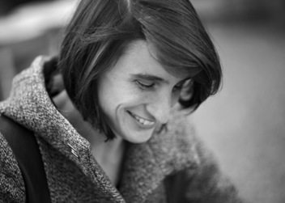

* 1978          Geboren in Lausanne, aufgewachsen in St.Maurice (VS)
* 1996 - 2007   Ausbildung und Arbeit als Schmuckgestalterin
* 2007 - 2010   Studium an der Hochschule der Künste Zürich
* 2010          Bachelor of Arts ZFH
* Lebt und arbeitet als freischaffende Künstlerin in Zürich
